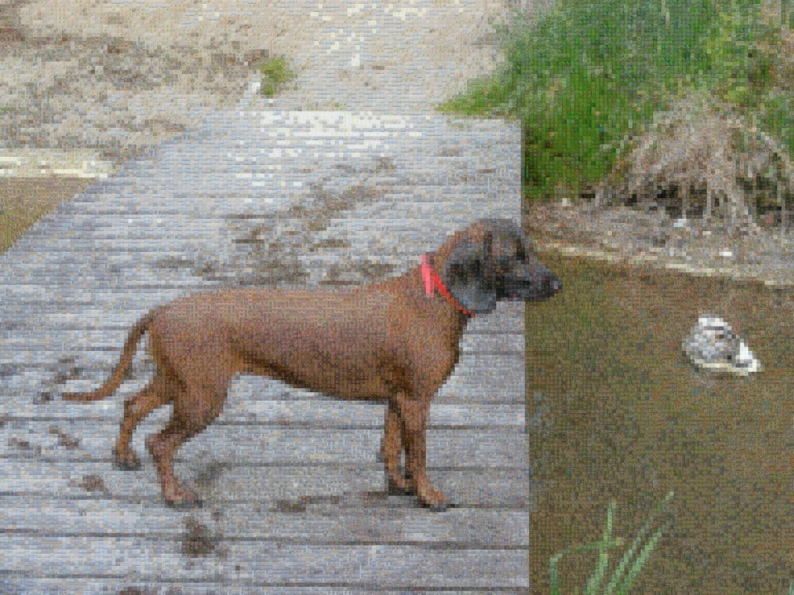
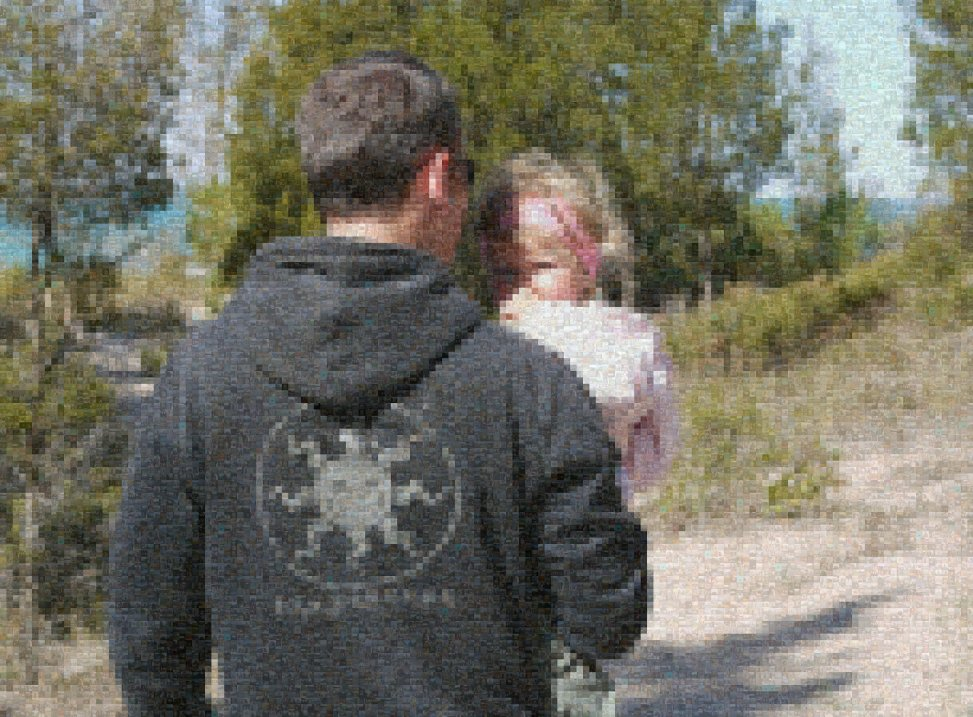

# mosaic
Mosaic creator 

A simple application that builds a mosaic picture from smaller images (written in Go).
My original plan was to build an octree containing all the images in a given path, associated with their "average" color, but it turns out it's faster to just use random images and blend them a bit harder.

Command-line options (option - default value - description):
* blend_factor - 0.5 - Blend factor for small mosaic images [0-1], use 0 for single-color blocks
* cache_images - 0 - Preload N images and only use these, much faster
* chunk_size - 2 - Chunk size to replace with an individual image
* cpuprofile - write cpu profile to file (if not empty)
* dir - Directory to scan looking for pictures
* downscale - 16 - How much do we downscale the original image before 'chunking' it (N=scale to 1/Nth of the original)
* image - Source image for the mosaic
* img_ext - .jpg - List of image extension (comma separated)
* match_tolerance - 40 - Color tolerance for the image to be considered
* max_color_stdev - 40 - If image's color stdev is greater this (for at least 2 channels), we skip it
* max_matches - 6 - Consider up to this many matches for each block. 1=best match only
* out_chunk_size - 64 - Size of a single chunk in an output image
* out_file - mosaic.png - Output image (the mosaic)
* rebuild_octree - false - Rebuild octree
* use_octree - false - If false, just pick a random image for blocks. Only makes sense with a low blend factor

If you'd like to use octree, we have to build it first. Minimum set of arguments for that is rebuild_octree + dir. App will scan the directory and all sub directories and build an octree containing average colors for each picture. Keep in mind some images might not have a clear "dominant" color, you can use max_color_stdev to reject ones that have too much variety. Please note it needs to load each image so process can take some time for directories with thousands of entries.

As I mentioned, my original vision was to simply pick imagas that have their "average" color the closes to the block we're processing, but turned out that in practice it doesn't work so great:
* if the source image has big block of same color, they'll be replaced by the same "best matching" image, which is a bit repetitive and doesn't look great. It can be countered to some extent by allowing for bigger tolerance (match_tolerance) and bigger number of matches (max_matches)
* some colors might simply not have a good match (e.g. bright red), depending on you collection
* it's _slow_ ... for my default settings (~2kx2k source image, downscale of 4) it needs to load 12k+ JPGs

An example created using this method:

For these reasons I decided to also experiment with a different approach - simply load (and cache) N random images and blend the crap out of them (low blend_factor). It is much faster (although depends on N obviously) and it looks good enough IMO.

Method 2 (3000 cached images):

